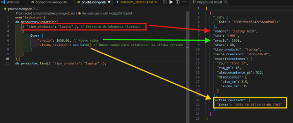

**Análisis comparativo (SQL vs NoSQL)**

Se realizó una comparativa entre las soluciones que ofrece un modelo relacional SQL y un modelo no relacional como lo es MongoDB, para esto se han tomado tres criterios importantes que marcan ventajas o desventajas significativas entre ambas soluciones. Con ello, se concuerda con que la mejor solución a implementar para el inventario TechStore es una solución NoSQL, ya que da apertura a un manejo varios de datos e información, además de tener una reducción de scripts complejos para la realización de búsquedas. Con ello, se ha demostrado y justificado de manera precisa la decisión del cambio de una base de datos relacional a una no relacional

|**Criterio**|**Solución Relacional**|**Solucion NoSQL**|**Justificación**|
| :-: | :-: | :-: | :-: |
|**Flexibilidad de Esquema**|Rígido (requiere ALTER TABLE o tablas EAV).|Flexible (documentos JSON/BSON).|TechStore maneja distintos tipos de datos, ya que debe guardar información “especifica” de los dispositivos que comercia, por lo que le es más conveniente crear campos que tengan estructuras dinámicas, para no tener que crear una tabla por cada tipo de producto distinto o tener campos vacíos dentro de las tablas.|
|**Modelo de datos**|Tablas normalizadas (ej: productos, detalles\_laptop).|Colección de documentos (ej: productos)|Al tener una colección para todos los distintos tipos de productos es más fácil agregar las especificaciones, como los detalles de una laptop, dentro de la misma colección, con ello se simplifica el modelo y se evita la necesidad de normalizar tablas como en la solución relacional.|
|**Consulta de datos**|Requiere JOINs complejos para obtener detalles|Consulta simple a un único documento|SQL necesita de varios JOINs para obtener uno grupo de datos, ya que la información de un mismo producto se encontraba relacionada en diversas tablas. Con MongoDB la consulta es mucho más fácil ya que toda la información se puede encontrar dentro del mismo documento.|

**Diseño del Modelo Relacional**

Se desarrolló el modelo entidad relación con el uso de la herramienta LucidChart en donde se indica la solución de un modelo relacional para el inventario “TechStore”

  

||||
| :- | :- | :- |
|**Proveedores**|Un proveedor podrá surtir como mínimo un producto y como máximo varios|**1:N**|
|**Productos**|Un producto puede venir como mínimo de un proveedor y como máximo de varios|**N:N**|
||
Un producto puede tener:

Cero o un detalles\_laptop.

Cero o un detalles\_smartphone 

Cero o un detalles\_monitor
|**0:1**|
||Un produto puede estar en una sola venta(No se puede vender el mismo productos dos veces)|**1:1**|
|**Ventas**|Una venta puede tener uno o varios productos|**1:N**|
||Una venta debe tener solo un cliente|**1:1**|
|**Clientes**|Un cliente puede tener una o varias ventas|**1:N**|

**Diseño del modelo NoSQL**

Ejemplo de un formato de estructura de un documento JSOn paea la colección productos, en donde se abordan todas las necesidades y criterios establecidos en el Makdown

**{**

`  `**"\_id": "ObjectId(...)",**

`  `**"nombre": "String",** 

`  `**"sku": "String (Indexado, Único)",**

` `**"precio": "Number",**

` `**"stock": "Number",**

` `**"tipo\_producto": "String (Enum: 'Laptop', 'Smartphone', 'Monitor')"**

` `**"fecha\_creacion": "** **Date",** 

`  `**"especificaciones": {**

`  `**}**

**}**

Ejemplo de agregación de una laptop con diversos tipos de especificaciones

{

`   `“\_id”: “ObjectId(…)“,

`   `"nombre": "Laptop ACER",

`  `"sku": "L001",

`  `"precio": 680.00,

`  `"stock": 10,

`  `"tipo\_producto": "Laptop",

`  `"fecha\_creacion": "2025-10-28",

`  `"especificaciones": {

`        `"cpu": "Core i7",

`        `"ram\_gb": 16,

`        `"almacenamiento\_gb": 512,

`        `"dimensiones": {

`           `"alto\_cm": 2.5,

`           `"ancho\_cm": 35,    

`        `}

`  `}

}

Ejemplo de agregación de una laptop con diversos tipos de especificaciones

{

`   `“\_id”: “ObjectId(…)“,

`   `"nombre": "Smartphone Samsung",

`  `"sku": "S001",

`  `"precio": 180.00,

`  `"stock": 100,

`  `"tipo\_producto": "Smartphone",

`  `"fecha\_creacion": "2025-10-28",

`  `"especificaciones": {

`        `“os”: “iOS”

`        `"ram\_gb": 16,

`        `"almacenamiento\_gb": 512,

`  `}

}

**Implementación y Manipulación**

Primero se creó el archivo operaciones.mongodb

Nos conectamos a la base de datos

  

Se borró la colección productos al inicio para que el script pueda volverse a ejecutar sin problemas

  

**Inserción de Datos (Create)**

Posterior a ello se realizó una inserción con el uso de insertMany()

.  

**Lectura de datos**

  

**Actualización de datos**

  

**Resultados de la ejecución**

**Inserción de datos**

  

**Lectura de datos**

Consulta 1: Mostrar todos los productos en la colección. (find())

  

Consulta 2: Mostrar solo los productos que sean de tipo "Laptop".

  

Consulta 3: Mostrar los productos que tengan más de 10 unidades en stock Y un precio menor a 1000.

  

Consulta 4: Mostrar solo el nombre, precio y stock de los "Smartphone" (Proyección).

  

**Actualización de datos**

Operación 1: Se vendió un Smartphone (busque uno por su sku). Reduzca su stock en 1 unidad. (Use $inc).

  

Operación 2: El precio de la Laptop ha subido. Actualice su precio a un nuevo valor y añada un nuevo campo ultima\_revision: new Date(). (Use $set).

  

**Análisis reflexivo**

**Pregunta 1: ¿Cuál fue la ventaja más significativa de usar un modelo de documento (MongoDB) para el caso "TechStore" en comparación con el modelo relacional que diseñó?** 

Desde mi punto de vista, la mayor ventaja observable, es que se logró evitar la creación de más tablas o en el caso de NoSQL, colecciones, ya que, al tener mayor flexibilidad, es permitido ingresar diversos tipos de dentro de nuestro campo de especificaciones, siendo ese uno de los principales problemas que se presentaron al momento de utilizar una base de datos estructural.

**Pregunta 2: ¿Cómo facilita el anidamiento de documentos (el campo especificaciones) la gestión de datos heterogéneos (diferentes atributos por producto)?**

Lo vuelve más fácil, ya que evita tener que crear una nueva tabla para esos datos específicos, o para dispositivos específicos. Esto a la vez ayuda a mejorar las consultas de los productos evitando JOINs complejos, logrando así una consulta más rápida y limpia.** 

**Pregunta 3: ¿Qué problemas potenciales podría enfrentar esta base de datos a futuro si no se controla la flexibilidad del esquema (es decir, si se permite insertar cualquier dato)?** 

Uno de los principales problemas puede ser la integridad y seguridad de los datos, ya que sin un control establecido, se pueden ingresar documentos con datos incorrectos o inconsistentes, que podrían provocar fallos en las consultas y el código mismo

**Pregunta 4: ¿Qué paso técnico recomendaría a continuación para "profesionalizar" esta base de datos? (Piense en rendimiento e integridad de datos que no cubrimos en este laboratorio)**

Sería factible realizar configuraciones de campos requeridos o tipos de datos específicos, además de establecer límites como cantidades máximas de caracteres o rangos numéricos, para evitar que los datos almacenados presenten inconsistencias o fallos.
